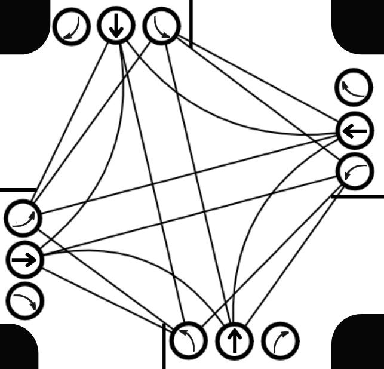

# Smart Intersection 🚦
## Overwiev
This project simulates an **intelligent traffic intersection** based on a given input file in **JSON** format. 
At each step, the system **dynamically** adjusts the green light to **maximize the efficiency of traffic** flow, 
reducing congestion and optimizing vehicle movement.

## Usage
To run the simulation on Linux (for Windows use gradlew.bat), use:  
``` 
.\gradlew run --args ="input.json output.json"
```
The output will be saved in `output.json`.

## Input format
The simulation requires a JSON file describing the intersection setup and incoming traffic:
```json
{
  "commands": [
    {
      "type": "addVehicle",
      "vehicleId": "vehicle1",
      "startRoad": "south",
      "endRoad": "north"
    },
    {
      "type": "addVehicle",
      "vehicleId": "vehicle2",
      "startRoad": "north",
      "endRoad": "south"
    },
    {
      "type": "step"
    },
    {
      "type": "step"
    },
    {
      "type": "addVehicle",
      "vehicleId": "vehicle3",
      "startRoad": "west",
      "endRoad": "south"
    },
    {
      "type": "addVehicle",
      "vehicleId": "vehicle4",
      "startRoad": "west",
      "endRoad": "south"
    },
    {
      "type": "step"
    },
    {
      "type": "step"
    }
  ]
}
```
Where:
- `addVehicle`: Adds a vehicle to the specified starting road (`startRoad`) with a destination (`endRoad`).
- `step`: Executes a simulation step, allowing vehicles to pass through the intersection based on the current green light.

## Output format
The output file contains a list of statuses for each simulation step:
```json
{
  "stepStatuses": [
    {
      "leftVehicles": [
        "vehicle2",
        "vehicle1"
      ]
    },
    {
      "leftVehicles": []
    },
    {
      "leftVehicles": [
        "vehicle3"
      ]
    },
    {
      "leftVehicles": [
        "vehicle4"
      ]
    }
  ]
}
```
Where:
- `stepStatuses`: Contains a list of statuses for each simulation step.
- `leftVehicles`: Lists the IDs of vehicles that exited the intersection during that step.

## Algorithm description

The algorithm models an intersection as a graph where each lane is a vertex, and potential conflicts between lanes are
represented as edges. This allows for an **optimal traffic light control strategy**, maximizing vehicle flow while
preventing collisions.

### Graph representation
- Each road has 3 incoming lanes and 3 outgoing lanes, designated for: Left turns  Going straight, Right turns.
- Each lane is a vertex in the graph, an edge exists between two vertices (lanes) if vehicles using those lanes
at the same time would collide. 

The resulting graph, called the conflict graph, represents all possible conflicting lane pairs at the intersection.  



### Assigning Weights to Vertices
Each vertex (lane) is assigned a weight, which determines its priority in the traffic light selection process.
The weight function is the core of the algorithm and can be adapted to optimize different goals, such as:
- Minimizing waiting time for vehicles. 
- Prioritizing certain roads (e.g., a main road over a side road).
- Considering emergency or public transport priority.
By modifying the weight function, the algorithm can be applied to any intersection model. 

### Finding the Optimal Traffic Light Combination
Using this weighted graph, the algorithm searches 
for the [maximum weighted independent set](https://en.wikipedia.org/wiki/Independent_set_(graph_theory)#Maximal_independent_set)
— a set of non-conflicting lanes that allows the maximum number of vehicles to pass safely. Once this set is
determined, the algorithm updates
the traffic lights accordingly: lanes within the selected independent set receive a green light,
allowing vehicles to proceed, while all other lanes remain red. This process repeats dynamically
at each simulation step, continuously adjusting based on real-time traffic conditions.

### Generalization to Any Intersection Model
A key advantage of this method is its flexibility—by defining the intersection
as a conflict graph and adjusting the weight function, the algorithm can be applied
to any type of intersection, making it highly adaptable for different traffic scenarios.
This makes it a powerful and scalable solution for intelligent traffic management.